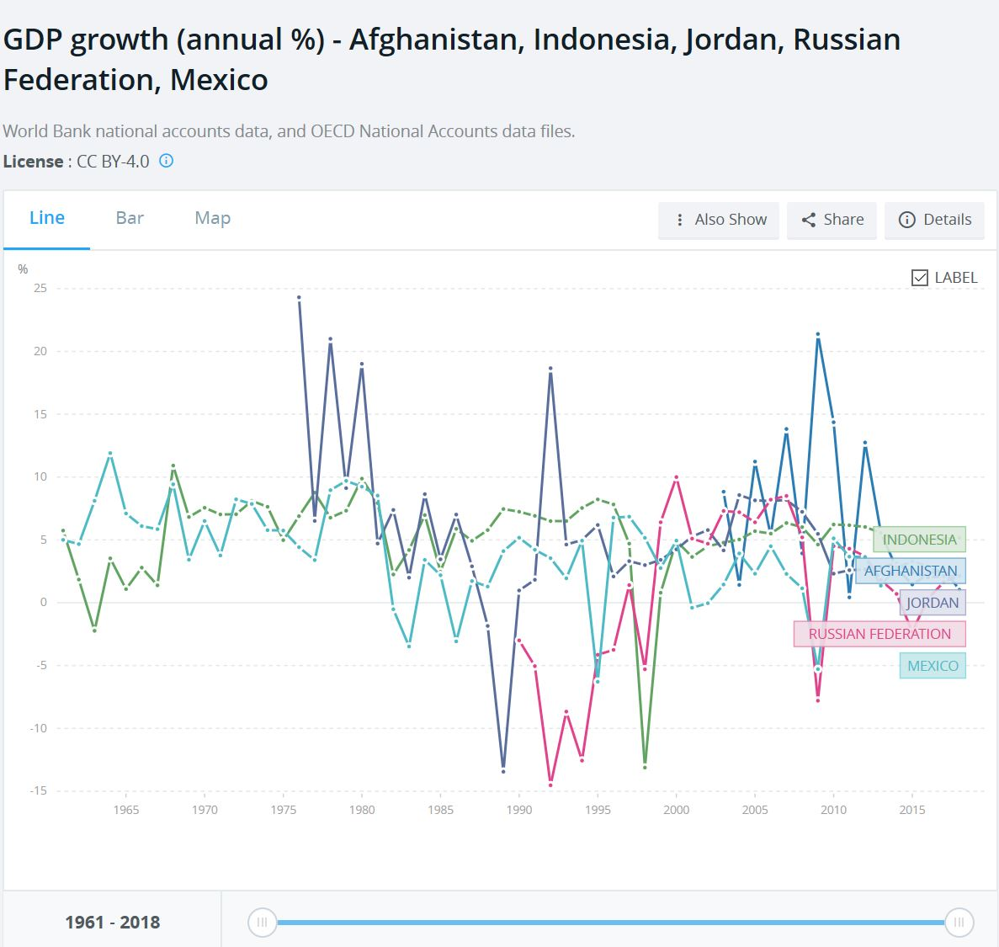
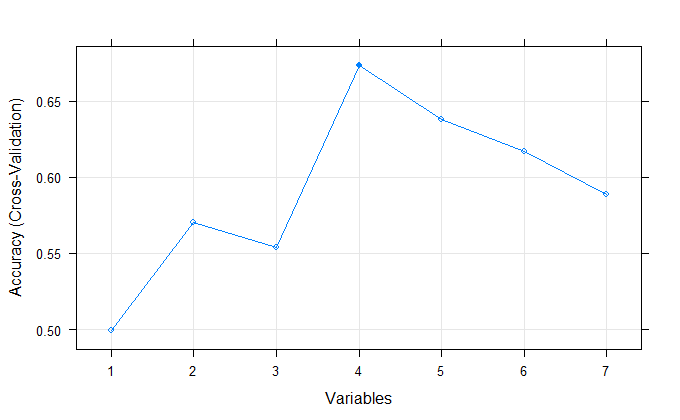
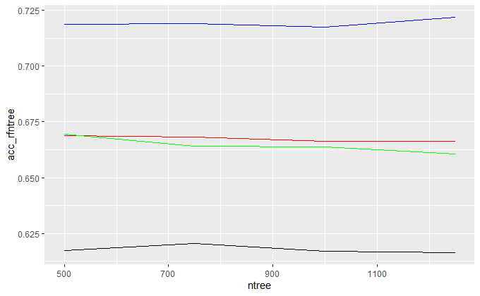
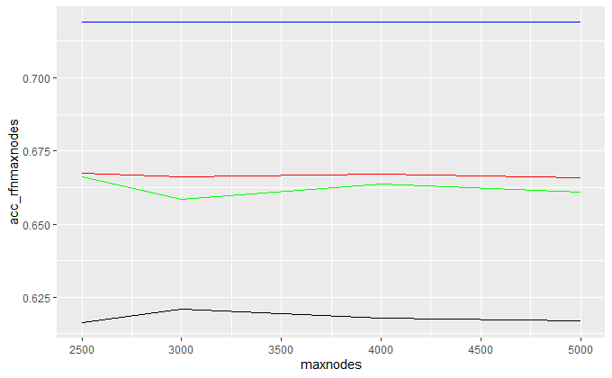
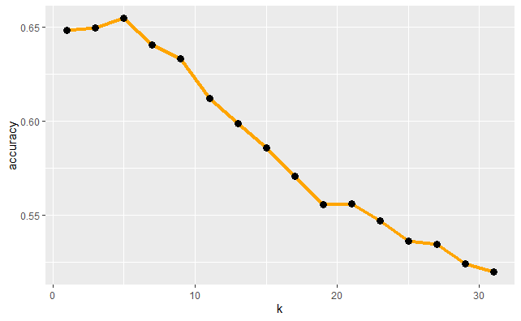

```{r basic, include=F}
# use this function to conveniently load libraries and work smoothly with knitting
# can add quietly=T option to the require() function
loadPkg = function(pkg, character.only = FALSE) { 
  if (!character.only) { pkg <- as.character(substitute(pkg)) }
  pkg <- ifelse(!character.only, as.character(substitute(pkg)) , pkg)  
  if (!require(pkg,character.only=T, quietly =T)) {  install.packages(substitute(pkg),dep=T); if(!require(pkg,character.only=T)) stop("Package not found") } 
}
loadPkg(knitr)

# unload/detact package when done using it
unloadPkg = function(pkg, character.only = FALSE) { 
  if(!character.only) { pkg <- as.character(substitute(pkg)) } 
  search_item <- paste("package", pkg,sep = ":") 
  while(search_item %in% search()) { detach(search_item, unload = TRUE, character.only = TRUE) } 
}
```

```{r setup, echo=FALSE, cache=FALSE}
loadPkg(knitr)
loadPkg(rmdformats)

## Global options
options(max.print="75")
opts_chunk$set(echo=FALSE,
	             cache=TRUE,
               prompt=FALSE,
               tidy=TRUE,
               comment=NA,
               message=FALSE,
               warning=FALSE)
opts_knit$set(width=75)
```


# Introduction
Team 010100 are the following members: Izzy Illari, Lucia Illari, Omar Qusous, and Lydia Teinfalt. You may find our work over on [GitHub](https://github.com/IzzyIllari/DATS-Model-Proj).

For the second portion of our group project, we kept Olympics data from the EDA. Our SMART questions were `What factors can be used to model the probability of being awarded a medal?` What groups/clusters do athletes of different sports fall into? How does a pandemic affect the medals awarded? How can the evolution of athlete characteristics over time be modelled? With these questions in mind we went to see if we could find use the data on Olympians to find patterns and create models that could answer the questions.

We used a dataset called `120 years of Olympic history: athletes and results` on Kaggle over here: [https://www.kaggle.com/heesoo37/120-years-of-olympic-history-athletes-and-results](https://www.kaggle.com/heesoo37/120-years-of-olympic-history-athletes-and-results). This historical dataset includes all Olympic Games from Athens 1896 to Rio 2016, which was scraped from [https://www.sports-reference.com/](https://www.sports-reference.com/). We focused on data from Olympic events 1960-2016 when looking at clustering, Kmeans, Linear and Logit Regression and trends over time. For the pandemic analysis, we focused on data of Olympics participating in events before and after the H1N1 Pandemic from 1918-1919.   

The report is organized as follows:

1. Summary of Dataset
2. Data Prep
3. EDA
4. Clustering, Kmeans, Kmedoids 
5. Linear and Logit Regression
6. Random Forest
7. Pandemic (Spanish Flu)
8. Trends over time
9. Summary and Conclusion
10. References

# Summary of Dataset
The data looks like the following:

```{r xkablesummary, include = FALSE}
loadPkg(xtable)
loadPkg(kableExtra)
loadPkg(stringi)

xkabledply = function(smmry, title='Caption', pos='left') { # Thanks Ryan Longmuir for the codes
  smmry %>%
    xtable() %>% 
    kable(caption = title, digits = 4) %>%
    kable_styling(position = "center") %>%
    kable_styling(bootstrap_options = "striped", full_width = F,
    position = pos)
}

xkablesummary = function(df) { 
  #' Combining base::summary, xtable, and kableExtra, to easily display numeric variable summary of dataframes. 
  #` If the categorical variables has less than 6 levels, the function will still run without error.
  #' ELo 202003 GWU DATS
  #' version 1
  #' @param df The dataframe.
  #' @return The summary table for display, or for knitr to process into other formats 
  #' @examples
  #' xkablesummary( faraway::ozone )
  #' xkablesummary( ISLR::Hitters )
  
  s = summary(df) %>%
    apply( 2, function(x) stringr::str_remove_all(x,c("Min.\\s*:\\s*","1st Qu.\\s*:\\s*","Median\\s*:\\s*","Mean\\s*:\\s*","3rd Qu.\\s*:\\s*","Max.\\s*:\\s*")) ) %>% # replace all leading words
    apply( 2, function(x) stringr::str_trim(x, "right")) # trim trailing spaces left
  
  colnames(s) <- stringr::str_trim(colnames(s))
  
  if ( dim(s)[1] ==6 ) { rownames(s) <- c('Min','Q1','Median','Mean','Q3','Max') 
  } else if ( dim(s)[1] ==7 ) { rownames(s) <- c('Min','Q1','Median','Mean','Q3','Max','NA') }
  
  s %>%
    xkabledply("Table: Statistics summary.", "center")

}

xkablevif = function(model) { 
  #' Combining faraway::vif, xtable, and kableExtra, to easily display numeric summary of VIFs for a model. 
  #' ELo 202003 GWU DATS
  #' version 1
  #' @param df The dataframe.
  #' @return The summary table for display, or for knitr to process into other formats 
  #' @examples
  #' xkablevif( model )
  
  vifs = table( names(model$coefficients)[2:length(model$coefficients)] ) # remove intercept to set column names
  vifs[] = faraway::vif(model) # set the values

  vifs %>%
    xtable() %>% 
    kable(caption = "VIFs of the model", digits = 4, col.names = 'VIF') %>% # otherwise it will only has the generic name as 'V1' for the first vector in the table
    kable_styling(position = "center") %>%
    kable_styling(bootstrap_options = "striped", full_width = F,
    position = "left")
}
```

```{r import_data}
olympic_data <- data.frame(read.csv("olympic_data.csv"))
olympic_data$ID <- as.factor(olympic_data$ID)
olympic_data$BMI.Category <- as.factor(olympic_data$BMI.Category)
olympic_data$Medal.No.Yes <- as.factor(olympic_data$Medal.No.Yes)
#head(olympic_data)
str(olympic_data)
```

The athlete events data has `r ncol(olympic_data)` columns and `r nrow(olympic_data)` rows/entries, for a total of `r ncol(olympic_data)*nrow(olympic_data)` individual data points. In `olympic_data` each row corresponds to an individual athlete competing in an individual Olympic event. The variables are the following:

1. ID: Unique number for each athlete
2. Name: Athlete's name
3. Sex: M or F
4. Age: Integer
5. Height: centimeters
6. Weight: kilograms
7. Team: Team name
8. NOC: National Olympic Committee 3-letter code
9. Games: Year and season
10. Year: Integer
11. Season: Summer or Winter
12. City: Host city
13. Sport
14. Event
15. Medal: Gold, Silver, Bronze, or NA

To prepare our data for EDA we dropped the Olympic event: Art Sculpting. NAs were also removed. We have modified the data from the kaggle dataset from which it was originally taken. The dataset now starts at 1960 and includes the new following variables:

1. Decade (factor)
2. First name (factor)
3. Last name (factor)
4. BMI (numeric)
5. BMI category (factor)
6. Population (numeric)
7. GDP (numeric)
8. GDPpC (numeric)
9. Medal: Yes or No (factor)


```{r remove_NAs, echo = FALSE}
olympic.data <- olympic_data

loadPkg(VIM)
aggr(olympic.data)
unloadPkg(VIM)

olympic_data_noNA <- na.omit(olympic_data)
olympic_data <- olympic_data_noNA
data_sport <- split(olympic_data_noNA, olympic_data_noNA$Sport)
```


# EDA

For EDA, we can do a quick summary to just look at the data.

```{r keep, results = "markup"}
xkablesummary(olympic_data)

# loadPkg(psych)
# pairs.panels(olympic_data[,-length(olympic_data)], 
#              method = "pearson",
#              hist.col = "#CCFF66",
#              density = TRUE,
#              ellipses = TRUE
#              )
# unloadPkg(psych)

olympic_data$Sex.Int <- c(as.numeric(as.factor(olympic_data$Sex)))
olympic_data$NOC.Int <- c(as.numeric(as.factor(olympic_data$NOC)))
olympic_data$Sport.Int <- c(as.numeric(as.factor(olympic_data$Sport)))
```

# Olympics Correlation plot

Just quickly visualizing thw correlation will be useful for model building, but we have to be mindful of the fact that columns such as Medal and Medal.No.Yes are noturally going to be highly correlated.

```{r subset_corr, echo = FALSE}
loadPkg("dplyr")
olympics_subset <- olympic_data %>% filter(!is.na(Age)) %>% select(Year, NOC.Int, Sex.Int, Age, Height, Weight, BMI, BMI.Category, Population, GDP, GDPpC, Medal.No.Yes)

#olympic_data9 <- data.frame(read.csv("olympic_data.csv"))
olympic_data9 <- olympic_data
# olympic_data9$BMI.Category <- as.factor(olympic_data9$BMI.Category)
# olympic_data9$Medal.No.Yes <- as.factor(olympic_data9$Medal.No.Yes)
# olympic_data9$Medal <- as.factor(olympic_data9$Medal)
olympic_data_1 <- olympic_data9 %>% select(c(-ID, -Name, -Last.Name, -Height, -Weight, -Team, -Games, -City, -Event, -GDP, -Population, -First.Name))
olympic_data_1 <- olympic_data_1 %>% filter(Medal.No.Yes=='1')
olympic_data_1 <- olympic_data_1 %>% filter(!Medal=='No Medal')

olympic_data_1 <- olympic_data_1 %>% filter(!is.na(olympic_data_1$Age))
olympic_data_1 <- olympic_data_1 %>% filter(!is.na(olympic_data_1$GDPpC))
olympic_data_1 <- olympic_data_1 %>% filter(!is.na(olympic_data_1$BMI))
olympic_data_1 <- olympic_data_1 %>% filter(!is.na(olympic_data_1$Medal))
olympic_data_1$Medal <- droplevels(olympic_data_1$Medal)

unloadPkg("dplyr")

loadPkg("corrplot")
cols.num <- c(1:length(olympic.data))
num.df <- olympic.data
num.df[cols.num] <- sapply(olympic.data[cols.num],as.numeric)
cor.all <- cor(num.df[,c(1,2,8:13,15:17,24)], use="pairwise.complete.obs")
cmat.all <- corrplot(cor.all, method="pie", type = "upper", order = "hclust", tl.col = "black", tl.srt = 45)
unloadPkg("corrplot")
```

It might be more useful to focus in on the correlations for only the variable Medal.No.Yes and Medal:

```{r focus_corr, results = "markup"}
loadPkg(corrr)
loadPkg(plyr)

cor.medNY <- focus(correlate(num.df, use="pairwise.complete.obs"), Medal.No.Yes)
cor.medNY[order(cor.medNY$Medal.No.Yes, decreasing = TRUE),] %>%
  kable("html", align = 'cccc') %>%
  kable_styling(bootstrap_options = c("striped", "hover", "condensed", "responsive"),full_width = T)

cor.medal <- focus(correlate(num.df, use="pairwise.complete.obs"), Medal)
cor.medal[order(cor.medal$Medal, decreasing = TRUE),] %>%
  kable("html", align = 'cccc') %>%
  kable_styling(bootstrap_options = c("striped", "hover", "condensed", "responsive"),full_width = T)

unloadPkg(corrr)
unloadPkg(plyr)
```

Unless you ignore the athletes that didn't receive a medal, building a general model from the variable Medal.No.Yes might be a better idea, based off the strength of the correlations.

# Clustering, Kmeans, Kmedoids 

My first thought was to do some clustering with just the numeric columns originally present in the data, namely Age, Weight, and Height, so I decided to look at some 3D scatter plots.

```{r 3d_scatter, echo = FALSE}
loadPkg(plot3D)
par(mfrow=c(1,2))
soft.df <- subset(olympic.data, Sport == "Softball")[,c(9:11)]
scatter3D(soft.df[,1], soft.df[,2], soft.df[,3],colkey = FALSE, bty ="g", xlab = "Age (years)",
          ylab ="Height (cm)", zlab = "Weight (kg)", main = "Softball", ticktype = "detailed")

tri.df <- subset(olympic.data, Sport == "Triathlon")[,c(9:11)]
scatter3D(tri.df[,1], tri.df[,2], tri.df[,3],colkey = FALSE, bty ="g", xlab = "Age (years)",
          ylab ="Height (cm)", zlab = "Weight (kg)", main = "Triathlon", ticktype = "detailed")
unloadPkg(plot3D)
```

So we are indeed seeing different behavior with these two sports - Triathlon appears more spread out but Softball appears to mostly clustered around lower ages. Well first thing's first, before we just go ahead seeing what clusters there are, we should calculate the Hopkin's Statistic. We can conduct the Hopkins Statistic test iteratively, using 0.5 as the threshold to reject the alternative hypothesis. That is, if H < 0.5, then it is unlikely that D has statistically significant clusters. Put in other words, If the value of Hopkins statistic is close to 1, then we can reject the null hypothesis and conclude that the dataset D is significantly a clusterable data. We need to make sure to remove NAs and scale the variables to make them comparable. Scaling consists of transforming the variables such that they have mean zero and standard deviation one.

```{r useful_packages_clust, include = FALSE}
loadPkg(dplyr)
loadPkg(tidyverse)
loadPkg(ggplot2)
loadPkg(cluster)
loadPkg(factoextra)
loadPkg(seriation)
loadPkg(fpc)
#loadPkg(rgl)
loadPkg(gridExtra)
loadPkg(clustertend)
```

```{r prep, echo = FALSE}
triPG <- subset(olympic_data, Sport == "Triathlon")[,c("Age", "Height", "Weight", "Population", "GDP")]
triPG_o <- triPG
triPG_o <- triPG_o[complete.cases(triPG_o), ]
triPG_o <- na.omit(triPG_o)
triPG <- triPG[complete.cases(triPG), ]
triPG <- na.omit(triPG) #to remove any missing value that might be present in the data
triPG <- scale(triPG)
#data must be standardized to make variables comparable; consists of transforming the variables such that they have mean zero and standard deviation one

tri <- subset(olympic_data, Sport == "Triathlon")[,c("Age", "Height", "Weight")]
tri_o <- tri
tri_o <- tri_o[complete.cases(tri_o), ]
tri_o <- na.omit(tri_o)
tri <- tri[complete.cases(tri), ]
tri <- na.omit(tri)
tri <- scale(tri)

softPG <- subset(olympic_data, Sport == "Softball")[,c("Age", "Height", "Weight", "Population", "GDP")]
softPG_o <- softPG
softPG_o <- softPG_o[complete.cases(softPG_o), ]
softPG_o <- na.omit(softPG_o)
softPG <- softPG[complete.cases(softPG), ]
softPG <- na.omit(softPG)
softPG <- scale(softPG)

soft <- subset(olympic_data, Sport == "Softball")[,c("Age", "Height", "Weight")]
soft_o <- soft
soft_o <- soft_o[complete.cases(soft_o), ]
soft_o <- na.omit(soft_o)
soft <- soft[complete.cases(soft), ]
soft <- na.omit(soft)
soft <- scale(soft)
```

```{r hopkins, results = "markup"}
set.seed(123)
print("Triathlon without Population and GDP")
cat("Hopkins Statistic H =", get_clust_tendency(tri, n = nrow(tri)-1, graph = FALSE)$hopkins_stat, "\n")

print("Triathlon with Population and GDP")
cat("Hopkins Statistic H =", get_clust_tendency(triPG, n = nrow(triPG)-1, graph = FALSE)$hopkins_stat, "\n")

print("Softball without Population and GDP")
cat("Hopkins Statistic H =", get_clust_tendency(soft, n = nrow(soft)-1, graph = FALSE)$hopkins_stat, "\n")

print("Softball with Population and GDP")
cat("Hopkins Statistic H =", get_clust_tendency(softPG, n = nrow(softPG)-1, graph = FALSE)$hopkins_stat, "\n")
```

Clearly all of these values are greater than 0.5, so there are statistically significant clusters present. Of course, Kmeans (and Kmedoids) requires us to specify "how many $k$, i.e., clusters?" We can use the elbow method, the silhouette method, and the gap statistic to get an idea for how many $k$ we should be specifying.

```{r num_k_tri, echo = FALSE}
set.seed(123)

tk_k1 <- fviz_nbclust(tri, kmeans, method = "wss")
tk_k2 <- fviz_nbclust(tri, kmeans, method = "silhouette")
tk_k3 <- fviz_nbclust(tri, kmeans, method = "gap_stat")
tk_p1 <- fviz_nbclust(tri, pam, method = "wss")
tk_p2 <- fviz_nbclust(tri, pam, method = "silhouette")
tk_p3 <- fviz_nbclust(tri, pam, method = "gap_stat")

grid.arrange(tk_k1,tk_k2, tk_k3, top = "Clusters with Kmeans for Triathlon, without Population and GDP", ncol = 1, nrow = 3)
grid.arrange(tk_p1,tk_p2, tk_p3, top = "Clusters with Kmedoids for Triathlon, without Population and GDP", ncol = 1, nrow = 3)

tpgk_k1 <- fviz_nbclust(triPG, kmeans, method = "wss")
tpgk_k2 <- fviz_nbclust(triPG, kmeans, method = "silhouette")
tpgk_k3 <- fviz_nbclust(triPG, kmeans, method = "gap_stat")
tpgk_p1 <- fviz_nbclust(triPG, pam, method = "wss")
tpgk_p2 <- fviz_nbclust(triPG, pam, method = "silhouette")
tpgk_p3 <- fviz_nbclust(triPG, pam, method = "gap_stat")

grid.arrange(tpgk_k1,tpgk_k2, tpgk_k3, top = "Clusters with Kmeans for Triathlon, with Population and GDP", ncol = 1, nrow = 3)
grid.arrange(tpgk_p1,tpgk_p2, tpgk_p3, top = "Clusters with Kmedoids for Triathlon, with Population and GDP", ncol = 1, nrow = 3)
```

For the Triathlon data with only variables Age, Height, and Weight, for Kmeans and Kmedoids, we'll try $k$=2, and for the Triathlon data that additionally has Population and GDP, we'll try $k$=3 and $k$=7.

```{r num_k_soft, echo = FALSE}
sk_k1 <- fviz_nbclust(soft, kmeans, method = "wss")
sk_k2 <- fviz_nbclust(soft, kmeans, method = "silhouette")
sk_k3 <- fviz_nbclust(soft, kmeans, method = "gap_stat")
sk_p1 <- fviz_nbclust(soft, pam, method = "wss")
sk_p2 <- fviz_nbclust(soft, pam, method = "silhouette")
sk_p3 <- fviz_nbclust(soft, pam, method = "gap_stat")

grid.arrange(sk_k1,sk_k2, sk_k3, top = "Clusters with Kmeans for Softball, without Population and GDP", ncol = 1, nrow = 3)
grid.arrange(sk_p1,sk_p2, sk_p3, top = "Clusters with Kmedoids for Softball, without Population and GDP", ncol = 1, nrow = 3)

spgk_k1 <- fviz_nbclust(softPG, kmeans, method = "wss")
spgk_k2 <- fviz_nbclust(softPG, kmeans, method = "silhouette")
spgk_k3 <- fviz_nbclust(softPG, kmeans, method = "gap_stat")
spgk_p1 <- fviz_nbclust(softPG, pam, method = "wss")
spgk_p2 <- fviz_nbclust(softPG, pam, method = "silhouette")
spgk_p3 <- fviz_nbclust(softPG, pam, method = "gap_stat")

grid.arrange(spgk_k1,spgk_k2, spgk_k3, top = "Clusters with Kmeans for Softball, with Population and GDP", ncol = 1, nrow = 3)
grid.arrange(spgk_p1,spgk_p2, spgk_p3, top = "Clusters with Kmedoids for Softball, with Population and GDP", ncol = 1, nrow = 3)
```

This is interesting for the Softbll. Though according to the Hopkin's statistic there were statistically significant clusters, $k$=1 keeps being suggested. There is likely to be a lot of overlapping data points in the clusters when $k\geq$2. I can try $k$=2 for Softball with only Age, Weight, and Height, and $k$=3 for Kmedoids and $k$=6 for Kmeans for Population and GDP in addition.

```{r tri_clust, results = "markup"}
get_pca(prcomp(tri))$contrib %>%
  kable("html", align = 'cccc') %>%
  kable_styling(bootstrap_options = c("striped", "hover", "condensed", "responsive"),full_width = T)

fviz_cluster(kmeans(tri, centers = 2, nstart = 25), geom = "point", data = tri)
fviz_cluster(pam(tri, 2), geom = "point")

loadPkg(dplyr)
loadPkg(tidyr)
loadPkg(tidyverse)

tri_o %>%
  mutate(Cluster = kmeans(tri, centers = 2, nstart = 25)$cluster) %>%
  group_by(Cluster) %>%
  summarise_all("mean")

tri_o %>%
  mutate(Cluster = pam(tri, 2)$cluster) %>%
  group_by(Cluster) %>%
  summarise_all("mean")
```

I will only print out the means for the clustering here with the most distinct clusters, which is $k$=3 using Kmeans.

```{r triPG_clust, results = "markup"}
get_pca(prcomp(triPG))$contrib %>%
  kable("html", align = 'cccc') %>%
  kable_styling(bootstrap_options = c("striped", "hover", "condensed", "responsive"),full_width = T)

fviz_cluster(kmeans(triPG, centers = 3, nstart = 25), geom = "point", data = triPG)
triPG_o %>%
  mutate(Cluster = kmeans(triPG, centers = 3, nstart = 25)$cluster) %>%
  group_by(Cluster) %>%
  summarise_all("mean")

fviz_cluster(kmeans(triPG, centers = 7, nstart = 25), geom = "point", data = triPG)
# triPG_o %>%
#   mutate(Cluster = kmeans(triPG, centers = 7, nstart = 25)$cluster) %>%
#   group_by(Cluster) %>%
#   summarise_all("mean")

fviz_cluster(pam(triPG, 3), geom = "point")
# triPG_o %>%
#   mutate(Cluster = pam(triPG, 3)$cluster) %>%
#   group_by(Cluster) %>%
#   summarise_all("mean")

fviz_cluster(pam(triPG, 7), geom = "point")
# triPG_o %>%
#   mutate(Cluster = pam(triPG, 7)$cluster) %>%
#   group_by(Cluster) %>%
#   summarise_all("mean")
```

We use Population and GDP here as a proxy for Team, since Team is not a continuous variable. Yes, we could make variables such as Team numeric, and use it that way, but what woudl a cluster with a mean Team = 2.5 mean? How is an athlete "inbetween" a team? In this way we can get a sense for the Teams while using continuous variables. For example, cluster 3, the only countries that meet this GDP requirement are China and the US, so there is a distinct cluster for the Triathlon data made up of American and Chinese athlete. In fact, if we look at all the GDP values, they are all relatively high, and correspond to countries like Australia, Canada, etc, which tells us that these clusters are all made of athletes from rather rich countries.

Moving on to softball:

```{r soft_clust, results = "markup"}
get_pca(prcomp(soft))$contrib %>%
  kable("html", align = 'cccc') %>%
  kable_styling(bootstrap_options = c("striped", "hover", "condensed", "responsive"),full_width = T)

# fviz_cluster(kmeans(soft, centers = 1, nstart = 25), geom = "point", data = soft)
fviz_cluster(kmeans(soft, centers = 2, nstart = 25), geom = "point", data = soft)
# fviz_cluster(pam(soft, 1), geom = "point")
fviz_cluster(pam(soft, 2), geom = "point")

soft_o %>%
  mutate(Cluster = kmeans(soft, centers = 2, nstart = 25)$cluster) %>%
  group_by(Cluster) %>%
  summarise_all("mean")

soft_o %>%
  mutate(Cluster = pam(soft, 2)$cluster) %>%
  group_by(Cluster) %>%
  summarise_all("mean")
```

Using $k$=2 wasn't actually too bad! And Kmeans and Kmedoids appears to have recovered very similar centers. Moving on to the Softball data with Population and GDP, technically $k$=3 was for Kmedoids and $k$=6 was for Kmeans, but I will try both cluster sizes for both methods.

```{r softPG_clust, results = "markup"}
get_pca(prcomp(softPG))$contrib %>%
  kable("html", align = 'cccc') %>%
  kable_styling(bootstrap_options = c("striped", "hover", "condensed", "responsive"),full_width = T)

fviz_cluster(kmeans(softPG, centers = 3, nstart = 25), geom = "point", data = softPG)
# triPG_o %>%
#   mutate(Cluster = kmeans(triPG, centers = 3, nstart = 25)$cluster) %>%
#   group_by(Cluster) %>%
#   summarise_all("mean")

fviz_cluster(kmeans(softPG, centers = 6, nstart = 25), geom = "point", data = softPG)
# triPG_o %>%
#   mutate(Cluster = kmeans(triPG, centers = 7, nstart = 25)$cluster) %>%
#   group_by(Cluster) %>%
#   summarise_all("mean")

fviz_cluster(pam(softPG, 3), geom = "point")
# triPG_o %>%
#   mutate(Cluster = pam(triPG, 3)$cluster) %>%
#   group_by(Cluster) %>%
#   summarise_all("mean")

fviz_cluster(pam(softPG, 6), geom = "point")
# triPG_o %>%
#   mutate(Cluster = pam(triPG, 7)$cluster) %>%
#   group_by(Cluster) %>%
#   summarise_all("mean")
```

As we can see, the clusters are all on top of each other. $k$=3 seems to be roughly the same clusters using Kmeans or Kmedoids, but $k$=6 appears to have given very different results depending on the method. I will not print out the means/medoids here, since the clusters are on top of each other and not as distinct. We could investigate what these clusters look like when plotted for the different prinicpal axes:

```{r other_axes, echo = FALSE}
fviz_cluster(kmeans(softPG, centers = 3, nstart = 25), geom = "point", data = softPG, axes = c(4, 5))
```

but the clusters are still on top of each other. It appears for some sports adding Population and GDP can help define new clusters, but for other sports, it muddies them. It is possible other clustering methods may reveal clusters not found using Kmeans and Kmedoids.

```{r unload_packages_clust, include = FALSE}
#unloadPkg(rgl)
unloadPkg(fpc)
unloadPkg(clustertend)
unloadPkg(seriation)
unloadPkg(factoextra)
unloadPkg(gclus)
unloadPkg(cluster)
unloadPkg(tidyverse)
unloadPkg(broom)
unloadPkg(tidyr)
unloadPkg(viridis)
unloadPkg(gridExtra)
unloadPkg(ggcorrplot)
unloadPkg(ggplot2)
unloadPkg(dplyr)
```

# Logit Regression

## Linear Model
We added a new column, TMedals, to the Olympic dataset to hold the total number of medals earned for event year. The purpose of this new numeric column is to be able to build linear models. 
```{r}
loadPkg(dplyr)
loadPkg(kableExtra)


new_data <- olympic_data %>% filter(Medal.No.Yes == "1") %>% group_by(Year) %>% add_tally(as.numeric(Medal.No.Yes), name="TMedals")

keep_columns <- c( "NOC.Int", "Year", "Decade", "Sex.Int", "Age", "Height", "Sport.Int", "Weight", "BMI", "Population", "GDP", "TMedals")
new_data <- na.omit(new_data)

new_data_subset <- new_data[keep_columns]
new_data_subset <- new_data_subset %>% filter(!is.na(Age))
new_data_subset$Decade <- as.numeric(new_data_subset$Decade)

unloadPkg(dplyr)
```

```{r cor, eval=FALSE}
#str(new_data_subset)
loadPkg(corrplot)


olympic_tmedals_cor <- cor(new_data_subset, use="complete.obs")
corrplot.mixed(olympic_tmedals_cor)

```

Based on the correlation plot, GDP, Population, Height, and Sport.Int are the features with the highest correlation.  Four models will be built, adding each feature to find the best fitted model. We can ignore Year and Decade showing high correlation with total number of medals because the field as created based on the olympic year. 

```{r linear_model, results="markup"}
loadPkg(dyn)
model1 = dyn$lm(TMedals ~ GDP, data=new_data)
sum_md1 = summary(model1)
#sum_md1
```

```{r vif_md1}
vif_md1 = faraway::vif(model1)
#vif_md1
```

```{r model2}
model2 = dyn$lm(TMedals ~ GDP + Population, data=new_data)
sum_md2 = summary(model2)
#sum_md2
```

```{r vifmodel2}
vif_md2 = faraway::vif(model2)
#vif_md2
```

```{r model3}
model3 = dyn$lm(TMedals ~ GDP + Population + Height , data=new_data)
sum_md3 = summary(model3)
#sum_md3
```

```{r vifmodel3}
vif_md3 = faraway::vif(model3)
#vif_md3
```

```{r model4}
model4 = dyn$lm(TMedals ~ GDP + Population + Height + Sport.Int, data=new_data)
sum_md4 = summary(model4)
sum_md4
```

```{r vifmodel4}
vif_md4 = faraway::vif(model4)
#vif_md4
```

```{r summary_linear_models}
model_names <- c("Linear Model 1: TMedals ~ GDP", "Linear Model 2: TMedals ~ GDP + Population", "Linear Model 3: TMedals ~ GDP + Population + Height", "Linear Model 4: TMedals ~ GDP + Population + Height + Sport.Int")
m <- c(summary(model1))
ar2_values <- c(summary(model1)$adj.r.squared,summary(model2)$adj.r.squared, summary(model3)$adj.r.squared, summary(model4)$adj.r.squared)
df <- data.frame(model_names, ar2_values)

names(df) <- c("", "Adjusted R2")

kable(df) %>% kable_styling()

vdf <- data.frame(vif_md2)

vtable <- kable(vdf) %>% kable_styling
faraway::vif(model4) %>%
    kable(caption = "VIFs of the model", digits = 4, col.names = 'VIF') %>%
    kable_styling(position = "center") %>%
    kable_styling(bootstrap_options = "striped", full_width = F,
    position = "left")
```

According to the Adjusted $R^2$ value, model 4 is the best fit. The coefficients’ p-values for (Intercept), GDP, Population, Height, and Sport are less than significance level $\alpha$ = 0.05, making them statistically significant. The VIF values for GDP, Population, Height and Sport are greater than 1 but less than 5 so multicollinearity is not an issue with this model. 

```{r anova}
anova_m <- anova(model1, model2, model3, model4)
anova_m
summary(anova_m)
```
An Anova test was used to compare the four models. The p-values are less then standard $\alpha$ = 0.05 so the models differ significantly. There is enough variance that you can reject the null hypothesis that the models are the same.

```{r unloadpkg_linear}
unloadPkg(dyn)
unloadPkg(kableExtra)
unloadPkg(xtable)
```

## Logit Regression: Factors influencing Earning Olympic Medals
We used logit regression to model what factors influence the chances of an athlete receiving a medal, `Medal.No.Yes`.
```{r subset_data_logit}
loadPkg(dplyr)


ol_dt <- olympic_data %>% group_by(Year) %>% add_tally(as.numeric(Medal.No.Yes), name="TMedals")

keep_columns <- c( "NOC.Int", "Sport.Int", "Year", "Decade", "Sex.Int", "Age", "Height", "Weight", "BMI", "Population", "GDP", "Medal.No.Yes", "TMedals")
ol_dt  <- na.omit(ol_dt)

ol_dt_subset <- ol_dt[keep_columns]
ol_dt_subset  <- ol_dt_subset %>% filter(!is.na(Age))
ol_dt_subset $Decade <- as.numeric(ol_dt_subset $Decade)

unloadPkg(dplyr)
```


```{r ggplot}

loadPkg(ggplot2)

ggplot(ol_dt_subset, aes(Age, fill = Medal.No.Yes)) + geom_density(alpha = 0.2)

ggplot(ol_dt_subset, aes(BMI, fill = Medal.No.Yes)) + geom_density(alpha = 0.2)

ggplot(ol_dt_subset, aes(Sex.Int, fill = Medal.No.Yes)) + geom_density(alpha = 0.2)

ggplot(ol_dt_subset, aes(Height, fill = Medal.No.Yes)) + geom_density(alpha = 0.2)

ggplot(ol_dt_subset, aes(Sport.Int, fill = Medal.No.Yes)) + geom_density(alpha = 0.2)

```

```{r logit}

olympic_logit <- glm(Medal.No.Yes ~ Sex.Int + Height + Sport.Int, data = ol_dt_subset, binomial(link = "logit"))
summary(olympic_logit)
exp(coef(olympic_logit))


## CIs using standard errors
confint.default(olympic_logit)
```

```{r HosmerLemeshow, eval=FALSE}

loadPkg(ResourceSelection) # function hoslem.test( ) for logit model evaluation
olympic_logit1_Hoslem = hoslem.test(ol_dt_subset$Medal.No.Yes, fitted(olympic_logit)) # Hosmer and Lemeshow test, a chi-squared test
unloadPkg(ResourceSelection) 
olympic_logit1_Hoslem

```

```{r AUC}
loadPkg(pROC) 
test_prob = predict(olympic_logit, newdata = ol_dt_subset, type = "response")
test_roc = roc(Medal.No.Yes~test_prob, data=ol_dt_subset, plot = TRUE, print.auc = TRUE)

unloadPkg(pROC)
```
```{r McFadden}
olympic_nulllogit2 <- glm(Medal.No.Yes ~ 1, data = ol_dt_subset, family = "binomial")
mcFadden = 1 - logLik(olympic_logit)/logLik(olympic_nulllogit2)
```

```{r McFadden1}
loadPkg("pscl") # use pR2( ) function to calculate McFadden statistics for model eval
olympicLogit1pr2 = pR2(olympic_logit)
#olympicLogit1pr2
unloadPkg("pscl") 
```

The McFadden (part of the pseudo-R$^2$ statistics) value of `r round(olympicLogit1pr2['McFadden'], digits=3)` also shows the model is not a particularly great model, with only `r round(olympicLogit1pr2['McFadden']*100, digits=1)`% of the variation explained. 

## Logistic Regression: Medal.No.Yes variable

```{r remove_missing_factors, echo = FALSE}
#source of code: https://stackoverflow.com/a/44316204/8902095
remove_missing_levels <- function(fit, test_data) {
  test_data %>%
    droplevels() %>%
    as.data.frame() -> test_data

  if (any(class(fit) == "glmmPQL")) {
    factors <- (gsub("[-^0-9]|as.factor|\\(|\\)", "",
                     names(unlist(fit$contrasts))))
    if (length(factors) == 0) {
      return(test_data)
    }

    map(fit$contrasts, function(x) names(unmatrix(x))) %>%
      unlist() -> factor_levels
    factor_levels %>% str_split(":", simplify = TRUE) %>%
      extract(, 1) -> factor_levels

    model_factors <- as.data.frame(cbind(factors, factor_levels))
  } else {
    factors <- (gsub("[-^0-9]|as.factor|\\(|\\)", "",
                     names(unlist(fit$xlevels))))
    if (length(factors) == 0) {
      return(test_data)
    }

    factor_levels <- unname(unlist(fit$xlevels))
    model_factors <- as.data.frame(cbind(factors, factor_levels))
  }

  predictors <- names(test_data[names(test_data) %in% factors])

  for (i in 1:length(predictors)) {
    found <- test_data[, predictors[i]] %in% model_factors[
      model_factors$factors == predictors[i], ]$factor_levels
    if (any(!found)) {
      var <- predictors[i]
      test_data[!found, predictors[i]] <- NA
      test_data %>%
        droplevels() -> test_data
      message(sprintf(paste0("Setting missing levels in '%s', only present",
                             " in test data but missing in train data,",
                             " to 'NA'."),
                      var))
    }
  }
  return(test_data)
}
```

Now we have already looked at the correlation matrix for the entire dataset, and it looks like Medal.No.Yes might have some stronger correlations than Medal. We’ll be attempting to use the entire dataset for logistic regression to see what variables go into predicting whether an athlete is awarded a medal or not.

```{r glm_all, results = "markup"}
glm.all <- glm(Medal.No.Yes ~ GDP + Height + Weight + Population + Sport, data = olympic.data, binomial(link = "logit"))
summary(glm.all)

glm.data <- remove_missing_levels (fit = glm.all, test_data = olympic.data)

loadPkg(regclass)
regclass::confusion_matrix(glm.all)

loadPkg(pscl)
pR2(glm.all)["McFadden"]

loadPkg(pROC)
prob = predict(glm.all, newdata = glm.data, type = "response")
glm.data$prob = prob
h <- roc(Medal.No.Yes~prob, data = glm.data)
plot(h)
pROC::auc(h)
```

Team was not included because it was not significant however the overall model is significant. For the area under the curve, it is `r pROC::auc(h)>=0.8` that it is more than 0.8, so this is not a good model. The true negative percentage was `r regclass::confusion_matrix(glm.all)[1]/(regclass::confusion_matrix(glm.all)[1]+regclass::confusion_matrix(glm.all)[4])*100`% and the true positive percentage was `r regclass::confusion_matrix(glm.all)[5]/(regclass::confusion_matrix(glm.all)[2]+regclass::confusion_matrix(glm.all)[5])*100`% so it appears that the model is mostly labelling everything as not receiving a medal. 

Let’s try doing a model for Basketball, one of the more popular sports by athlete counts. Now I’m going to include Age, Weight, and Height and first, but there is something interesting that happens:

```{r basketball_fit_awh, results = "markup"}
basket1 <- subset(olympic.data, Sport == "Basketball")
glm.b <- glm(Medal.No.Yes ~ Age + Weight + Height + GDP + Population + Team, data = basket1, binomial(link = "logit"))
summary(glm.b)

basket3 <- remove_missing_levels (fit = glm.b, test_data = basket1)

pR2(glm.b)["McFadden"]

regclass::confusion_matrix(glm.b)

prob = predict(glm.b, newdata = basket3, type = "response")
basket3$prob = prob
h.b <- roc(Medal.No.Yes~prob, data = basket3)
plot(h.b)
pROC::auc(h.b)
```

Looking at this, we see that the variables Age, Height, and Weight are not significant, but GDP, Population, and Team are! Let’s go ahead and see what the model looks like without these variables…

```{r basketball_fit, results = "markup"}
glm.b1 <- glm(Medal.No.Yes ~ GDP + Population + Team, data = basket1, binomial(link = "logit"))
summary(glm.b1)

basket31 <- remove_missing_levels (fit = glm.b1, test_data = basket1)

pR2(glm.b1)["McFadden"]

regclass::confusion_matrix(glm.b1)

prob1 = predict(glm.b1, newdata = basket31, type = "response")
basket31$prob = prob1
h.b1 <- roc(Medal.No.Yes~prob1, data = basket31)
plot(h.b1)
pROC::auc(h.b1)
```

The area under the curve is hardly affected - it’s a `r abs(pROC::auc(h.b1)-pROC::auc(h.b))` difference! Moreover, the model with just GDP, Population, and Team is an overall significant model, and it is `r pROC::auc(h.b1)>=0.8` that the area under the curve is more than 0.8. In fact, the area under the curve is `r abs(pROC::auc(h.b1)-1)` away from being 1, so this would appear to be a very good model. The true negative percentage was `r regclass::confusion_matrix(glm.b1)[1]/(regclass::confusion_matrix(glm.b1)[1]+regclass::confusion_matrix(glm.b1)[4])*100`% and the true positive percentage was `r regclass::confusion_matrix(glm.b1)[5]/(regclass::confusion_matrix(glm.b1)[2]+regclass::confusion_matrix(glm.b1)[5])*100`% so this model is much better at predicting when an athlete will recieve a medal. Of course, we would like to see the TP value be higher, but it is interesting how Basketball is a sport that can be modelled by variables related to the country the athletes come from, rather than characteristics describing the athletes themselves…

Softball (and Baseball) were removed from the Olympics because the USA and Japan dominated the sport at the Olympics, let's see what variables affect the logistical regression model for Softball then.

```{r softball_fit_awh, results = "markup"}
soft <- subset(olympic.data, Sport == "Softball")
glm.s1 <- glm(Medal.No.Yes ~ Age + Weight + Height + GDP + Population + Team, data = soft, binomial(link = "logit"))
summary(glm.s1)

soft.s1 <- remove_missing_levels (fit = glm.s1, test_data = soft)

pR2(glm.s1)["McFadden"]

regclass::confusion_matrix(glm.s1)

prob.s1 = predict(glm.s1, newdata = soft.s1, type = "response")
soft.s1$prob.s1 = prob.s1
h.s1 <- roc(Medal.No.Yes~prob.s1, data = soft.s1)
plot(h.s1)
pROC::auc(h.s1)
```

Look at these results! Age, Height and Weight have no significance, and GDP is at the * level and population is at the ** level. The area under the curve is `r pROC::auc(h.s1)` and The true negative percentage was `r regclass::confusion_matrix(glm.s1)[1]/(regclass::confusion_matrix(glm.s1)[1]+regclass::confusion_matrix(glm.s1)[4])*100`% and the true positive percentage was `r regclass::confusion_matrix(glm.s1)[5]/(regclass::confusion_matrix(glm.s1)[2]+regclass::confusion_matrix(glm.s1)[5])*100`%.

Let’s only keep Population and Team and see what happens…

```{r softball_fit, results = "markup"}
glm.s2 <- glm(Medal.No.Yes ~ Population + Team, data = soft, binomial(link = "logit"))
summary(glm.s2)

soft.s2 <- remove_missing_levels(fit = glm.s2, test_data = soft)

pR2(glm.s2)["McFadden"]

regclass::confusion_matrix(glm.s2)

prob.s2 = predict(glm.s2, newdata = soft.s2, type = "response")
soft.s2$prob.s2 = prob.s2
h.s2 <- roc(Medal.No.Yes~prob.s2, data = soft.s2)
plot(h.s2)
pROC::auc(h.s2)
```

The area under the curve is 'r pROC::auc(h.s2)' and the true negative percentage was `r regclass::confusion_matrix(glm.s2)[1]/(regclass::confusion_matrix(glm.s2)[1]+regclass::confusion_matrix(glm.s2)[4])*100`% and the true positive percentage was `r regclass::confusion_matrix(glm.s2)[5]/(regclass::confusion_matrix(glm.s2)[2]+regclass::confusion_matrix(glm.s2)[5])*100`%. Softball (and baseball) were removed from the Olympics because the USA and Japan dominated the sport at the Olympics, and it is clear here, looking at these models, that you can predict the chance of being awarded a model based solely on where the team was coming from. Of course, removing Softball from the Olympics had far reaching, negative impacts that are still felt by the sport years later… But it makes sense looking at these logistical regression models why there was felt a need to remove Softball and Baseball from the Olympics.

For some sports, however, Age and Height do play a role, such as in Swimming, where Weight, GDP, and Population were not statistically significant:

```{r swimming_fit, results = "markup"}
swim <- subset(olympic.data, Sport == "Swimming")
glm.a <- glm(Medal.No.Yes ~ Age + Weight + Height + GDP + Population + Team, data = swim, binomial(link = "logit"))
summary(glm.a)

swim1 <- remove_missing_levels (fit = glm.a, test_data = swim)

pR2(glm.a)["McFadden"]

regclass::confusion_matrix(glm.a)

prob.a = predict(glm.a, newdata = swim1, type = "response")
swim1$prob.a = prob.a
h.a <- roc(Medal.No.Yes~prob.a, data = swim1)
plot(h.a)
pROC::auc(h.a)

unloadPkg(pROC)
unloadPkg(regclass)
unloadPkg(pscl)
```

So for different sports, there are different factors that go into modeling whether an athelete is awarded a medal or not, and for some, they have a “human element” not captured by the data, and for others, this dataset has all the information needed to accurately predict whether you will recieve a medal or not.

# Predicting Model Winners Based on Athlete's Information and Sport

In this section a classification model will be built using kNN and Random Forest that can predict if an athlete with certain characteristics can win a gold, silver, or bronze medal when they participate in the Olympics.

First step is to drop columns that maybe not useful. This is done based on domain knowldge as well as recognoizing that some factors will be co-linearly related. For example Gross Domestic Product per capita (GDPpC) of a country's athlete will have a direct relationship to GDP and population. Another example is Weight, Height and BMI. The former two are included in BMI's calculation.

NA values are all dropped. Attempting linear interpolation for GDPpC assumes that that is linear in its nature, however, as shown in the figure below it has cyclical characterisitc.



Furthermore, estimating missing age, height and weight for athelets will result inaccurate data being input into models.

```{r OQ - import data and clean}
#moved most of this code to an earlier section where it would work reliably
head(olympic_data_1) %>% 
    kable() %>%
    kable_styling(position = "center") %>%
    kable_styling(bootstrap_options = "striped", full_width = F, position = 'left')
```

## Random Forest
Data is split into train and test sets at 70% and 30% ratio respectively.

```{r SplitTrainTest RF}
set.seed(1)
train_rows1 = sample(1:nrow(olympic_data_1), round(0.7 * nrow(olympic_data_1), 0),  replace = FALSE)
length(train_rows1) / nrow(olympic_data_1)
data_train1 = olympic_data_1[train_rows1, ]
data_test1 = olympic_data_1[-train_rows1, ]
nrow(data_train1)
nrow(data_test1)

# Establish that the train data indicies for kNN and logit match
# table(row.names(data_train1) == row.names(data_train2))
```

Below is feature selection method in Random Forest library to pick best features to produce highest accuracy using crossvalidation and Backward feature selection.

```{r BFS RF, eval=F}
set.seed(7)
# load the library
library(mlbench)
control <- rfeControl(functions=rfFuncs, method="cv", number=10)
results1 <- rfe(data_train1[,c("GDPpC" , "Sex" , "BMI" , "Age" , "Decade" , "Season" , "Sport")], data_train1[,"Medal"], sizes=c(1:8), rfeControl=control)
# summarize the results
print(results1)
# list the chosen features
predictors(results1)
# plot the results
plot(results1, type=c("g", "o"))
```



The results above indicate the features that give the best accuracy results are GDPpC, Sex, Decade and Sport.

```{r Random Forest}
loadPkg("randomForest")
# install.packages("ck37r") 
olympics_rf <- randomForest(Medal ~ GDPpC + Sex + Decade + Sport, data = data_train1, importance = TRUE)
olympics_rf
```

```{r predictions RF}
predTrain_rf <- predict(olympics_rf, data_train1[, c("GDPpC", "Sex" ,"Decade", "Sport")], type = "class")
predTest_rf  <- predict(olympics_rf, data_test1[, c("GDPpC", "Sex", "Decade", "Sport")], type = "class")
```

Initial model without any tuning gives the results below:
```{r cm train RF}
cm_train_rf = caret::confusionMatrix( predTrain_rf, reference = data_train1[, "Medal"] )
cm_train_rf$overall
cm_train_rf$byClass
acc_tra_rf <- cm_train_rf$overall[1]
sen_tra_rf <- cm_train_rf$byClass[1]
spe_tra_rf <- cm_train_rf$byClass[2]
pre_tra_rf <- cm_train_rf$byClass[3]
```

```{r cm test RF}
cm_test_rf = caret::confusionMatrix( predTest_rf, reference = data_test1[, "Medal"] )
cm_test_rf$overall
cm_test_rf$byClass
cm_test_rf$table
acc_tes_rf <- cm_test_rf$overall[1]
sen_tes_rf <- cm_test_rf$byClass[1]
spe_tes_rf <- cm_test_rf$byClass[2]
pre_tes_rf <- cm_test_rf$byClass[3]
```

Model Parameter Tunning:

Default number of trees built in the randomForest model is ntree = 500. The code below aims to increase the number of trees 3 times in 250 increments to see if it improves the confusion matrix metrics.

```{r ntree1, eval=F}

modellist_ntree <- list()

for (ntree in c(500, 750, 1000, 1250)){
  fit <- randomForest(Medal ~ GDPpC + Sex + Decade + Sport, 
               data = data_train1, 
               importance = TRUE,
               ntree = ntree)
  key <- toString(ntree)
  modellist_ntree [[key]] <- fit
}

```

```{r ntree2, eval=F}
predTest_rf50  <- predict(modellist_ntree['500'][[1]], data_test1[, c("GDPpC", "Sex", "Decade", "Sport")], type = "class")

cm_test_rf50 <- confusionMatrix(
  factor(predTest_rf50, levels = c("Bronze", "Gold", "Silver")),
  factor(data_test1$Medal, levels = c("Bronze", "Gold", "Silver")))

predTest_rf75  <- predict(modellist_ntree['750'][[1]], data_test1[, c("GDPpC", "Sex", "Decade", "Sport")], type = "class")

cm_test_rf75 <- confusionMatrix(
  factor(predTest_rf75, levels = c("Bronze", "Gold", "Silver")),
  factor(data_test1$Medal, levels = c("Bronze", "Gold", "Silver")))

predTest_rf100  <- predict(modellist_ntree['1000'][[1]], data_test1[, c("GDPpC", "Sex", "Decade", "Sport")], type = "class")

cm_test_rf100 <- confusionMatrix(
  factor(predTest_rf100, levels = c("Bronze", "Gold", "Silver")),
  factor(data_test1$Medal, levels = c("Bronze", "Gold", "Silver")))

predTest_rf125  <- predict(modellist_ntree['1250'][[1]], data_test1[, c("GDPpC", "Sex", "Decade", "Sport")], type = "class")

cm_test_rf125 <- confusionMatrix(
  factor(predTest_rf125, levels = c("Bronze", "Gold", "Silver")),
  factor(data_test1$Medal, levels = c("Bronze", "Gold", "Silver")))


ntree <- c(500, 750, 1000, 1250)

acc_rfntree <- c(cm_test_rf50$overall[1], cm_test_rf75$overall[1], cm_test_rf100$overall[1], cm_test_rf125$overall[1])
sen_rfntree <- c(cm_test_rf50$byClass[1], cm_test_rf75$byClass[1], cm_test_rf100$byClass[1], cm_test_rf125$byClass[1])
spe_rfntree <- c(cm_test_rf50$byClass[2],cm_test_rf75$byClass[2], cm_test_rf100$byClass[2], cm_test_rf125$byClass[2])
pre_rfntree <- c(cm_test_rf50$byClass[3], cm_test_rf75$byClass[3], cm_test_rf100$byClass[3], cm_test_rf125$byClass[3])

ntree_plot <- data.frame(ntree, acc_rfntree, spe_rfntree, pre_rfntree)

ggplot(ntree_plot, aes(x = ntree))+ 
  geom_line(aes(y = acc_rfntree), colour = "red") + 
  geom_line(aes(y = sen_rfntree), colour = "green") +
  geom_line(aes(y = spe_rfntree), colour = "blue") + 
  geom_line(aes(y = pre_rfntree), colour = "black")

```



ntree = 1000 gave the best results for all metrics except sensitivity which decrease by approximately 0.1%.

Next the maximum number of nodes is altered and models are compared with ntree = 1000. The maxnodes parameter was varied 2500, 3000, 4000 and 5000.

```{r maxnodes1, eval=F}

modellist_maxnodes <- list()

for (maxnodes in c(2500,3000,4000, 5000)){
  fit <- randomForest(Medal ~ GDPpC + Sex + Decade + Sport, 
               data = data_train1,
               importance = TRUE,
               ntree = 1000,
               maxnodes = maxnodes)
  key <- toString(maxnodes)
  modellist_maxnodes[[key]] <- fit
}
```

```{r maxnodes2, eval=F}
predTest_rf1  <- predict(modellist_maxnodes['2500'][[1]], data_test1[, c("GDPpC", "Sex", "Decade", "Sport")], type = "class")

cm_test_rf1 <- caret::confusionMatrix(
  factor(predTest_rf1, levels = c("Bronze", "Gold", "Silver")),
  factor(data_test1$Medal, levels = c("Bronze", "Gold", "Silver")))

predTest_rf2  <- predict(modellist_maxnodes['3000'][[1]], data_test1[, c("GDPpC", "Sex", "Decade", "Sport")], type = "class")

cm_test_rf2 <- caret::confusionMatrix(
  factor(predTest_rf2, levels = c("Bronze", "Gold", "Silver")),
  factor(data_test1$Medal, levels = c("Bronze", "Gold", "Silver")))

predTest_rf3  <- predict(modellist_maxnodes['4000'][[1]], data_test1[, c("GDPpC", "Sex", "Decade", "Sport")], type = "class")

cm_test_rf3 <- caret::confusionMatrix(
  factor(predTest_rf3, levels = c("Bronze", "Gold", "Silver")),
  factor(data_test1$Medal, levels = c("Bronze", "Gold", "Silver")))


predTest_rf4  <- predict(modellist_maxnodes['5000'][[1]], data_test1[, c("GDPpC", "Sex", "Decade", "Sport")], type = "class")

cm_test_rf4 <- caret::confusionMatrix(
  factor(predTest_rf4, levels = c("Bronze", "Gold", "Silver")),
  factor(data_test1$Medal, levels = c("Bronze", "Gold", "Silver")))

maxnodes <-c(2500,3000,4000, 5000)

acc_rfnmaxnodes <- c(cm_test_rf1$overall[1], cm_test_rf2$overall[1], cm_test_rf3$overall[1], cm_test_rf4$overall[1])
sen_rfnmaxnodes <- c(cm_test_rf1$byClass[1], cm_test_rf2$byClass[1], cm_test_rf3$byClass[1], cm_test_rf4$byClass[1])
spe_rfnmaxnodes <- c(cm_test_rf1$byClass[2], cm_test_rf2$byClass[2], cm_test_rf3$byClass[2], cm_test_rf4$byClass[2])
pre_rfnmaxnodes <- c(cm_test_rf1$byClass[3], cm_test_rf2$byClass[3], cm_test_rf3$byClass[3], cm_test_rf4$byClass[3])

nmaxnodes_plot <- data.frame(maxnodes, acc_rfnmaxnodes, sen_rfnmaxnodes, spe_rfnmaxnodes, pre_rfnmaxnodes)

ggplot(nmaxnodes_plot, aes(x = maxnodes))+ 
  geom_line(aes(y = acc_rfnmaxnodes), colour = "red") + 
  geom_line(aes(y = sen_rfnmaxnodes), colour = "green") +
  geom_line(aes(y = spe_rfnmaxnodes), colour = "blue") + 
  geom_line(aes(y = pre_rfnmaxnodes), colour = "black")

```



Given the small accuracy changes due to the tuning attempts above, the final model is kept as done before with default parameters.

```{r roc_auc for random forest}
loadPkg(pROC)
olympic_rf_prob <- predict(olympics_rf, data_test1[, c("GDPpC", "Sex", "Decade", "Sport")], type = "prob")
pred_dumms <- psych::dummy.code(olympic_rf_prob)
medal_dumms <- psych::dummy.code(data_test1$Medal)

result.roc <- roc(medal_dumms, olympic_rf_prob) # Draw ROC curve.
plot(result.roc, print.thres="best", print.thres.best.method="closest.topleft")

# source: https://stackoverflow.com/questions/30366143/how-to-compute-roc-and-auc-under-roc-after-training-using-caret-in-r
```
AUC = 0.75 an acceptable results. 
```{r Tree Plot}
# devtools::install_github('skinner927/reprtree')
loadPkg(reprtree)
reprtree:::plot.getTree(olympics_rf, k=499, depth = 5)
```

Next a KNN model will be built and compared with the final Random Forest model above.

## KNN

In order for the kNN model package to give the best result- the data is first scaled and all categorical columns are mapped to 1s and 0s. The same seed number and split percentages are used in order to be able to compare the model with Random Forest model. 

```{r KNN packages, include=F}
loadPkg(caret)
loadPkg(class)
loadPkg(e1071)
loadPkg(FNN) 
loadPkg(gmodels) 
loadPkg(psych) 
```

```{r Data Cleaning for KNN}
loadPkg(fastDummies)

olympic_data_2 <- data.table::copy(olympic_data_1)
olympic_data_2 <- olympic_data_2 %>% select(c(GDPpC, Sex, Decade, Sport, Medal))

normalize <- function(x) {return ((x - min(x)/(max(x)-min(x))))}

olympic_data_2$GDPpC <- normalize(olympic_data_2$GDPpC)

olympic_data_2 <-  dummy_cols(olympic_data_2, remove_first_dummy = TRUE)
olympic_data_2 <- olympic_data_2 %>% select(-c(Sex, Decade, Sport, Medal_Gold, Medal_Silver))
# "GDPpC", "Sex", "Decade", "Sport"
```

```{r SplitTrainTest kNN}
set.seed(1)
train_rows2 = sample(1:nrow(olympic_data_2), round(0.7 * nrow(olympic_data_2), 0),  replace = FALSE)
length(train_rows2) / nrow(olympic_data_2)
data_train2 = olympic_data_2[train_rows2, ]
data_test2 = olympic_data_2[-train_rows2, ]
nrow(data_train2)
nrow(data_test2)

column_names <- colnames(data_test2)
column_names <- column_names[column_names != "Medal"]
# Establish that the train data indicies for kNN and logit match
# table(row.names(data_train1) == row.names(data_train2))
```

```{r KNN Function, include=F}
chooseK = function(k, train_set, val_set, train_class, val_class){
  
  # Build knn with k neighbors considered.
  set.seed(1)
  class_knn = class::knn(train = train_set,    #<- training set cases
                  test = val_set,       #<- test set cases
                  cl = train_class,     #<- category for classification
                  k = k) #,                #<- number of neighbors considered
                  # use.all = TRUE)       #<- control ties between class assignments
                                        #   If true, all distances equal to the kth 
                                        #   largest are included
  
  tab = table(class_knn, val_class)
  
  # Calculate the accuracy.
  accu = sum(tab[row(tab) == col(tab)]) / sum(tab)                         
  cbind(k = k, accuracy = accu)
}
```

Plotting the accuracy of kNN with default parameters and varying k between 1-31 gives the restuls below for the same features used:

```{r KNN Model, eval=F}
knn_different_k = sapply(seq(1, 31, by = 2),
                         function(x) chooseK(x,
                                          train_set = data_train2[, column_names],
                                          val_set = data_test2[, column_names],
                                          train_class = data_train2[, "Medal"],
                                          val_class = data_test2[, "Medal"]))

# Reformat the results to graph the results.
str(knn_different_k)
knn_different_k_df = data.frame(k = knn_different_k[1,],
                             accuracy = knn_different_k[2,])

plotKnn <- ggplot(knn_different_k_df,
                  aes(x = k, y = accuracy)) +
                  geom_line(color = "orange", size = 1.5) +
                  geom_point(size = 3)
print(plotKnn)
```


From the plot above k=5 gives the best accuracy.

Validation using training data results are shown below:
```{r Chosen k5 validation model}
set.seed(1)
olympics_5NN1 = knn(train = data_train2[, column_names],
               test = data_train2[, column_names],
               cl = data_train2[, "Medal"], k = 5)
# str(olympics_5NN1)
# length(olympics_5NN1)
table(olympics_5NN1)
```

Validation using test data results are shown below:
```{r Chosen k5 testing model}
set.seed(1)
olympics_5NN2 = knn(train = data_train2[, column_names],
               test = data_test2[, column_names],
               cl = data_train2[, "Medal"], k = 5)
# str(olympics_5NN2)
# length(olympics_5NN2)
table(olympics_5NN2)
```

Confusion matrix for both training and test validations are shown below:
```{r Confusion Matrix 5NN 1}
cm_train_5NN = caret::confusionMatrix(olympics_5NN1, reference = as.factor(data_train2[, "Medal"]) )
cm_train_5NN$table
acc_tra1 <- cm_train_5NN$overall[1]
sen_tra1 <- cm_train_5NN$byClass[1]
spe_tra1 <- cm_train_5NN$byClass[2]
pre_tra1 <- cm_train_5NN$byClass[3]
```

```{r Confusion Matrix 5NN 2}
cm_test_5NN = caret::confusionMatrix(olympics_5NN2, reference = as.factor(data_test2[, "Medal"]) )
cm_test_5NN$table
acc_tes1 <- cm_test_5NN$overall[1]
sen_tes1 <- cm_test_5NN$byClass[1]
spe_tes1 <- cm_test_5NN$byClass[2]
pre_tes1 <- cm_test_5NN$byClass[3]
```

Below is the summary of Accuracy, Sensitivity, Specificity and Precision for the training and test sets at k = 5.

| Model |Accuracy    | Sensitivity | Specificity | Precision  |
|-------|------------|-------------|-------------|------------|
| Train |`r acc_tra1`|`r sen_tra1` |`r spe_tra1` |`r pre_tra1`|
| Test  |`r acc_tes1`|`r sen_tes1` |`r spe_tes1` |`r pre_tes1`|

An the results for Random Forest

| Model |Accuracy      | Sensitivity   | Specificity   | Precision    |
|-------|--------------|---------------|---------------|--------------|
| Train |`r acc_tra_rf`|`r sen_tra_rf` |`r spe_tra_rf` |`r pre_tra_rf`|
| Test  |`r acc_tes_rf`|`r sen_tes_rf` |`r spe_tes_rf` |`r pre_tes_rf`|

The results show that random Forest model give better results than kNN.

# Pandemic (Spanish Flu)
With the novel corona virus pandemic this year and its delay of the Olympics in Tokyo this year, we thought it would be interesting to study a last pandemic in the last century and analyze the impact it had on the Olympic performance. The following countries in Europe had 2.64 million excess deaths occurred during the period when the H1N1 Pandemic (also commonly called Spanish Flu) was circulating from January 1918 - June 1919: Italy, Bulgaria, Portugal, Spain, Netherlands, Sweden, Germany, Switzerland, France, Norway, Denmark, UK (Scotland, England, Wales). In the US, 675,000 people died from H1N1 which was 0.8 percent of the 1910 population. 

```{r loadpackages}
loadPkg(digest)
loadPkg(corrplot)
loadPkg(ggcorrplot)
loadPkg(ggplot2)
loadPkg(rmdformats)
loadPkg(knitr)
loadPkg(lattice) 
loadPkg(jtools)
loadPkg(faraway)
loadPkg(leaps)
loadPkg(gridExtra)
```

```{r read_pandemic_data}
p_olympics <- read.csv("pandemic_olympics.csv")
```
(JOHNSON, NIALL P. A. S., and JUERGEN MUELLER. “Updating the Accounts: Global Mortality of the 1918-1920 ‘Spanish’ Influenza Pandemic.” Bulletin of the History of Medicine, vol. 76, no. 1, 2002, pp. 105–115. JSTOR, www.jstor.org/stable/44446153. Accessed 19 Apr. 2020.) Taken from [@Johnson2002]

Of the European countries that suffered significant excess deaths during the Spanish Influenza Pandemic, these countries competed before and after 1918-1919: Denmark (DEN), France (FRA), Great Britain (GBR), Italy (ITA), Netherlands (NED), Norway (NOR), Sweden (SWE), and United States (USA). We created a separate pandemic data set containing athletes from these countries that competed in the Olympics between 1908-1928 to study before and after the pandemic. 

```{r H1N1_pandemic}
loadPkg(dplyr)
NOC_SF <- c("ITA", "NED", "SWE", "FRA", "NOR", "DEN", "GBR", "USA")
Medals <- c("Gold", "Silver", "Bronze")

pandemic_NOC_Yr_Mdl <- p_olympics %>% filter(Year >= 1908 & Year <= 1928,
                                         NOC %in% NOC_SF,
                                         Medal %in% Medals) %>% group_by(NOC, Year) %>% tally()

pandemic_NOC_Yr_Mdl$Year <- as.factor(pandemic_NOC_Yr_Mdl$Year)
unloadPkg(dplyr)

```
## Medals Earned 
The plot shows number of medals earned by Denmark (DEN), France (FRA), Great Britain (GBR), Italy (ITA), Netherlands (NED), Norway (NOR), Sweden (SWE), and United States (USA) before and after the pandemic. There may be more than Gold, Silver or Bronze medals earned by individuals in any sporting event; accounting for the group events.
```{r plots_num_medals , include=TRUE}
NOC_colors <- c("#A6CEE3", "#1F78B4", "#B2DF8A", "#33A02C", "#FB9A99", "#E31A1C", "#FDBF6F","#FF7F00")


pandemic_df <- data.frame(pandemic_NOC_Yr_Mdl$NOC, pandemic_NOC_Yr_Mdl$Year, pandemic_NOC_Yr_Mdl$n)
pandemic_df <- unique(pandemic_df)
colnames(pandemic_df) <- c("NOC", "Year", "Total.Medals")

pandemic_df$NOC <- as.factor(pandemic_df$NOC)


# Basic line plot with points
ggplot(data=pandemic_df, aes(x=Year, y=Total.Medals, group=NOC, color=NOC)) +
  geom_line(size=1)+
#  scale_colour_manual(values = NOC_colors) +
   geom_vline(xintercept = 1918) +
  geom_point()+
 theme_minimal() +
  theme(axis.text.x = element_text(angle = 90, vjust = 1, size = 9, hjust = 1),
        axis.text.y = element_text(vjust = 1, size = 9),
        panel.border = element_rect(color = "black", fill=NA, size=1)) +
  labs(title="H1N1 Pademic: Num of medals (n) vs. Year (1908-1928)", x="Year", y="Number of medals (n)") 


```
Great Britain (GBR), Denmark (DEN), Sweden (SWE) saw a decline in the number of medals their athletes earned after the pandemic. The Olympics were not held in 1916 due to World War I. 

## Number of Olympic Athletes
Looking at the same countries, the plot shows the number of athletes they sent to the Olympics from 1908 - 1928. 
```{r plots_num_athletes, include=TRUE}
loadPkg("dplyr")
NOC_SF <- c("ITA", "NED", "SWE", "FRA", "NOR", "DEN", "GBR", "USA")

p_num_athletes <- p_olympics %>% filter(Year >= 1908 & Year <= 1928,
                                         NOC %in% NOC_SF) %>% group_by(NOC, Year) %>% tally(unique(ID))


p_num_athletes_df <- data.frame(p_num_athletes$NOC, p_num_athletes$Year, p_num_athletes$n)
p_num_athletes_df <- unique(p_num_athletes_df)
colnames(p_num_athletes_df) <- c("NOC", "Year", "Total.Athletes")
p_num_athletes_df$NOC <- as.factor(p_num_athletes_df$NOC)
p_num_athletes_df$Year <- as.factor(p_num_athletes_df$Year)
p_num_athletes_df$V_line <- c("1918") 


# Basic line plot with points
ggplot(data=p_num_athletes_df, aes(x=Year, y=Total.Athletes, group=NOC, color=NOC)) +
  geom_line(size=1)+
#  scale_colour_manual(values = NOC_colors) +
   geom_vline(xintercept = 1918) +
  geom_point()+
 theme_minimal() +
  theme(axis.text.x = element_text(angle = 90, vjust = 1, size = 9, hjust = 1),
        axis.text.y = element_text(vjust = 1, size = 9),
        panel.border = element_rect(color = "black", fill=NA, size=1)) +
  labs(title="H1N1 Pademic: Num of athletes (n) vs. Year (1908-1928)", x="Year", y="Number of Athletes (n)")
  
unloadPkg("dplyr")
```
Great Britain and Sweden saw a sharp decline in the number of athletes that they sent to Olympic events after the pandemic. JOHNSON, NIALL P. A. S., and JUERGEN MUELLER reported England & Wales had approximately 200,000 death toll (per 1,000) and Sweden reported 34,374 death toll during the 1918-1919 pandemic. 

## Average Age of Olympians
The chart displays the average age of Olympians from the eight countries in our data before and after the pandemic.  
```{r ageSF}
loadPkg(dplyr)
NOC_colors <- c("#A6CEE3", "#1F78B4", "#B2DF8A", "#33A02C", "#FB9A99", "#E31A1C", "#FDBF6F","#FF7F00")

pandemic_avg_age <- p_olympics %>% filter(Year >= 1908 & Year <= 1928,
                                         NOC %in% NOC_SF,
                                         !is.na(Age)) %>% group_by(NOC, Year) %>% summarise(avg=mean(Age))

pandemic_avg_age$Year <- as.factor(pandemic_avg_age$Year)


# Basic line plot with points
ggplot(data=pandemic_avg_age, aes(x=Year, y=avg, group=NOC, color=NOC)) +
  geom_line(size=1)+
   geom_vline(xintercept = 1918) +
  geom_point()+
 theme_minimal() +
  theme(axis.text.x = element_text(angle = 90, vjust = 1, size = 9, hjust = 1),
        axis.text.y = element_text(vjust = 1, size = 9),
        panel.border = element_rect(color = "black", fill=NA, size=1)) +
  labs(title="H1N1 Pademic: Average Age vs. Year (1908-1928)", x="Year", y="Avg Age of Athletes (n)")
```
The H1N1 Influenza pandemic "Spanish flu" was fatal for individuals aged 20–40 years. The average age of Olympians competing after the pandemic was increased for all countries in our data set.  

## Average Height and Weight of Olympians
```{r w_h}
pandemic_avg_hw<- p_olympics %>% filter(Year >= 1908 & Year <= 1928,
                                         NOC %in% NOC_SF,
                                        !is.na(Height),
                                         !is.na(Weight)) %>% group_by(NOC, Year) %>% summarise(avg_h = mean(Height), avg_w = mean(Weight))
pandemic_avg_hw$Year <- as.factor(pandemic_avg_hw$Year)


# Basic line plot with points
h1 <- ggplot(data=pandemic_avg_hw, aes(x=Year, y=avg_h, group=NOC, color=NOC)) +
  geom_line(size=1)+
   geom_vline(xintercept = 1918) +
  geom_point()+
 theme_minimal() +
  theme(axis.text.x = element_text(angle = 90, vjust = 1, size = 9, hjust = 1),
        axis.text.y = element_text(vjust = 1, size = 9),
        panel.border = element_rect(color = "black", fill=NA, size=1)) +
  labs(title="H1N1 Pademic: Average Height vs. Year (1908-1928)", x="Year", y="Avg Height (cm)")
h1

w1 <- ggplot(data=pandemic_avg_hw, aes(x=Year, y=avg_w, group=NOC, color=NOC)) +
  geom_line(size=1)+
   geom_vline(xintercept = 1918) +
  geom_point()+
 theme_minimal() +
  theme(axis.text.x = element_text(angle = 90, vjust = 1, size = 9, hjust = 1),
        axis.text.y = element_text(vjust = 1, size = 9),
        panel.border = element_rect(color = "black", fill=NA, size=1)) +
  labs(title="H1N1 Pademic: Average Weight vs. Year (1908-1928)", x="Year", y="Avg Height (cm)")
w1

```
Netherlands (NED) and Norway (NOR) had significant increase in the average height and weight of their athletes after Spanish flu pandemic. Sweden (SWE) and France (FRA) saw a decrease in those averages. 


```{r model1}
loadPkg(dplyr)
olympics_subset <- olympic_data %>% filter(!is.na(Age)) %>% select(Year, NOC.Int, Sex.Int, Age, Height, Weight, BMI, BMI.Category, Population, GDP, GDPpC, Medal.No.Yes)

olympics_medal_count <- olympics_subset %>% group_by(Year) %>% tally(as.numeric(Medal.No.Yes))

p_olympics$Medal.No.Yes <- ifelse(p_olympics$Medal == "Gold" | p_olympics$Medal == "Silver" | p_olympics$Medal == "Bronze",1,0)
p_olympics$Medal.No.Yes[is.na(p_olympics$Medal.No.Yes)] <- 0

#p_olympics$Medal.No.Yes <- as.factor(p_olympics$Medal.No.Yes)


pandemic_total_medals_gold<- p_olympics %>% filter(Medal == "Gold", Season == "Summer") %>% group_by(NOC, Year) %>% tally(Medal.No.Yes)
#pandemic_total_medals_gold
pandemic_total_medals_silver<- p_olympics %>% filter(Medal == "Silver", Season == "Summer") %>% group_by(NOC, Year) %>% tally(Medal.No.Yes)
#pandemic_total_medals_silver
pandemic_total_medals_bronze<- p_olympics %>% filter(Medal == "Bronze", Season == "Summer") %>% group_by(NOC, Year) %>% tally(Medal.No.Yes)
#pandemic_total_medals_bronze
pandemic_total_medals <- p_olympics %>% filter(Medal %in% Medals, Season == "Summer") %>% group_by(NOC, Year) %>% tally(Medal.No.Yes)
#pandemic_total_medals

df<- data.frame(p_olympics$Medal, p_olympics$Medal.No.Yes)


unloadPkg(dplyr)
```

## Total Number of Olympic Medals (Summer Events) vs. Year 
```{r }
loadPkg(dplyr)

olympics_total_medals <- olympic_data %>% filter(Medal %in% Medals, Season == "Summer") %>%
group_by(NOC, Year) %>% tally(as.numeric(Medal.No.Yes))
#olympics_total_medals

olympics_summer_medals <- olympic_data %>% filter(Medal %in% Medals, Season == "Summer") %>%
group_by(Year) %>% tally(as.numeric(Medal.No.Yes))
colnames(olympics_summer_medals) <- c("Year", "Medals")
olympics_summer_medals$Year <- as.factor(olympics_summer_medals$Year)


ITA_Tmedals <- pandemic_total_medals %>% filter(NOC == "ITA")  
#ITA_Tmedals
ITA_Tmedals_all <- olympics_total_medals  %>% filter(NOC == "ITA")  
#ITA_Tmedals_all


#histogram of Number of Medals
loadPkg(ggplot2)
ggplot(data=olympics_summer_medals, aes(x=Year, y=Medals)) +
  geom_bar(stat="identity", fill="steelblue")+ylab("Total Number of Medals (Summer Events)") + theme_minimal()

unloadPkg(dplyr)
```

## Creating Time Series - Italy
During the 1918 Pandemic, Italy's death toll (per 1,000) was 390,000 death toll. According to [Worldodometer](https://www.worldometers.info/coronavirus/country/italy/), during the current Covid-19 pandemic, there has been 29,079 deaths in Italy. We will focus on Italy to conduct time series analysis. Can we see a pattern with historical Olympic data before and after the Spanish flu in order to predict how Italy will fare in future Olympics after is emerges from the current novel Corona virus pandemic?

The Olympics data for Italy from 1908-1928 was converted to a time series and plotted "Total Number of Medals vs Year". 

```{r forecast}

olympic_pts <- ts(ITA_Tmedals$n, start=1908, end = 1928, deltat=4)
olympic_all <- ts(ITA_Tmedals_all$n, start=1908, end = 2016, deltat=4)

ita_olympic <- ts.union(olympic_pts, olympic_all)


loadPkg(tidyverse)
ita_df <- data.frame(ita_olympic)
ita_df <- ita_df %>% mutate(Num.Medals= if_else(is.na(ita_df$olympic_pts), ita_df$olympic_all,ita_df$olympic_pts ))

ita_df <- subset(ita_df, select = c(Num.Medals))


ol_ts <- ts(ita_df,start=1908, end=2016, deltat=4)
#plot(ol_ts)

forecast::autoplot(ol_ts, color="Blue") +
  ggtitle("Italy in the Olympics: Number of Medals") +
  xlab("Year") +
  ylab("Number of Medals")


olympic_train <- window(ol_ts, start=1908, end = 1928, deltat=4)

olympic_test <- window(ol_ts, start=2008, end = 2016, deltat=4)


acf(ol_ts,main="Italy Olympics")

```
The time series shows random fluctuations in the data over time, no overall trend. The Auto Correlated Function (ACF) plot does not show seasonality, periodicity and cyclic nature of the series. The ACF values are less than 0.05, so they are not significant. So the number of medals may not be correlated to time.


## Using 1908-1928 Time Series as Training Data
From the quick EDA, time series may not be appropriate method to model the number of medals Italy may earn in future Olympics. As a learning academic exercise, we will explore different time series methodologies to forecast. 
```{r forecast1}

olympic_pts <- ts(ITA_Tmedals$n, start=1908, end = 1928, deltat=4)
olympic_all <- ts(ITA_Tmedals_all$n, start=1960, end = 2016, deltat=4)

olympic_train <- window(olympic_pts, start=1908, end = 1928, deltat=4)
olympic_train1 <- window(ol_ts, start=1960, end = 2008, deltat=4)
olympic_test <- window(ol_ts, start=2008, end = 2016, deltat=4)

```

## Exploring Holt-Winters and ETS-ANN Time Series Forecasting 
Holt-Winters uses exponential smoothing to make short-term forecasts. Models is designated as either additive or multiplicative. 

```{r fit}
fit1.hw <- HoltWinters(x=olympic_train, beta = FALSE,gamma = FALSE) 
plot(fit1.hw)
summary(fit1.hw)

fit2.hw <- HoltWinters(x=olympic_train1, beta = FALSE, gamma = FALSE) 
plot(fit2.hw)
#summary(fit2.hw)


loadPkg(forecast)
fit1.ets <-ets(olympic_train1, model="ANN")
#plot(fit1.ets)
fit1_forecast <- forecast(fit1.ets, h = 3) 
fit1_forecast

autoplot(fit1_forecast)+
  ggtitle("ETS Decomposition: Number of Medals") +
  xlab("Year") +
  ylab("Number of Medals")


fit1.hw.forecast <- forecast(fit1.hw, 8)

autoplot(fit1.hw.forecast)+
  ggtitle("Holt-Winters Forecast 1908-28: Number of Medals") +
  xlab("Year") +
  ylab("Number of Medals")

fit2.hw.forecast <- forecast(fit2.hw, 8)

autoplot(fit2.hw.forecast)+
  ggtitle("Holt-Winters Forecast 1960-2008: Number of Medals") +
  xlab("Year") +
  ylab("Number of Medals")


```
```{r accuracy}
loadPkg(dplyr)
ITA_2012 <- olympics_total_medals %>% filter (NOC == "ITA" & Year == "2012")
ITA_2016 <- olympics_total_medals %>% filter (NOC == "ITA" & Year == "2016")

```

## Time Series Linear Model for Italy
```{r }
h <- 10
fit.lin <- tslm(olympic_all ~ trend)
fcasts.lin <- forecast(fit.lin, h = h)
fit.exp <- tslm(olympic_all ~ trend, lambda = 0)
fcasts.exp <- forecast(fit.exp, h = h)

t <- time(olympic_all)
t.break1 <- 1908
t.break2 <- 1960
tb1 <- ts(pmax(0, t - t.break1), start = 1908)
tb2 <- ts(pmax(0, t - t.break2), start = 1908)

fit.pw <- tslm(olympic_all ~ t + tb1 + tb2)
t.new <- t[length(t)] + seq(h)
tb1.new <- tb1[length(tb1)] + seq(h)
tb2.new <- tb2[length(tb2)] + seq(h)

newdata <- cbind(t=t.new, tb1=tb1.new, tb2=tb2.new) %>%
  as.data.frame()
fcasts.pw <- forecast(fit.pw, newdata = newdata)

fit.spline <- tslm(olympic_all ~ t + I(t^2) + I(t^3) +
  I(tb1^3) + I(tb2^3))
fcasts.spl <- forecast(fit.spline, newdata = newdata)

autoplot(olympic_all) +
  autolayer(fitted(fit.lin), series = "Linear") +
  autolayer(fitted(fit.exp), series = "Exponential") +
  autolayer(fitted(fit.pw), series = "Piecewise") +
  autolayer(fitted(fit.spline), series = "Cubic Spline") +
  autolayer(fcasts.pw, series="Piecewise") +
  autolayer(fcasts.lin, series="Linear", PI=FALSE) +
  autolayer(fcasts.exp, series="Exponential", PI=FALSE) +
  autolayer(fcasts.spl, series="Cubic Spline", PI=FALSE) +
  xlab("Year") + ylab("Number of Medals") +
  ggtitle("Italy in the Olympics Time Series ") +
  guides(colour = guide_legend(title = " "))

```
Above plots try to fit the number of medals to an algorithm that could would best be able to predict the number of Olympic medals Italy will earn after Covid-19 pandemic. Visually, Cubic Spline seems closest in approximation.   

## Arima Model
```{r arima}
olympic_arima<- auto.arima(olympic_all, seasonal=FALSE)
summary(olympic_arima)

olympic_arima %>% forecast(h=10) %>% autoplot(include=8)
arima_predict <- predict(olympic_arima, n.ahead = 5)

```

The Olympic dat set was divided into a training set (1908-1928) which includes the 1918-1919 Spanish Influenza pandemic and test set (2008-2016). Using MAPE (Mean Absolute Percent Error) measures the size of the error in percentage terms (Taken from [@Stellwagen2011]) to evaluate Holt-Winters and ETS-ANN time series predictions for 2012 and 2016 for Medals won by Italy. The table below show MAPE values less than 10% which is a reasonable model.  


```{r time_series_summary}
hw_summary <- data.frame(cbind(year = c("2012","2016","2020"),
                               actual = c(132, 144, NA),
                              predicted = c(130,130, 130),
                              mape=c(9.72, 1.53,NA)))

colnames(hw_summary) <- c("Year", "Actual", "Predicted", "MAPE (%)")

hw_summary %>%
  kable(caption = "Holt-Winters and ETS-ANN Forecast: Italy Olympic Medals") %>%
  kable_styling()


```

ARIMA Time Series model predicts 107 medals for Italy in 2020. We will have to wait until the next Olympics to be able to evaluate the accuracy of these predictions for Italy's performance. 

The analysis of Olympic Medals that Italy earned before and after the 1918-1919 Spanish flu Pandemic and more current data were constructed into a time series on a superficial level. The resulting Olympic time series data on Italy could not be easily decomposed into the main components of a time series: trend, season or irregular fluctations. There are not hidden information we could be deciphered from studying 1918-1919 pandemic that could inform the future after Covid-19.


# Trends over time
# Summary and Conclusion
# References

